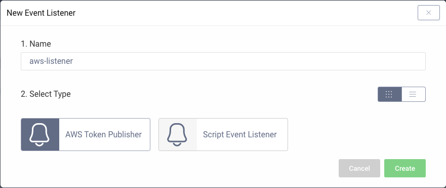
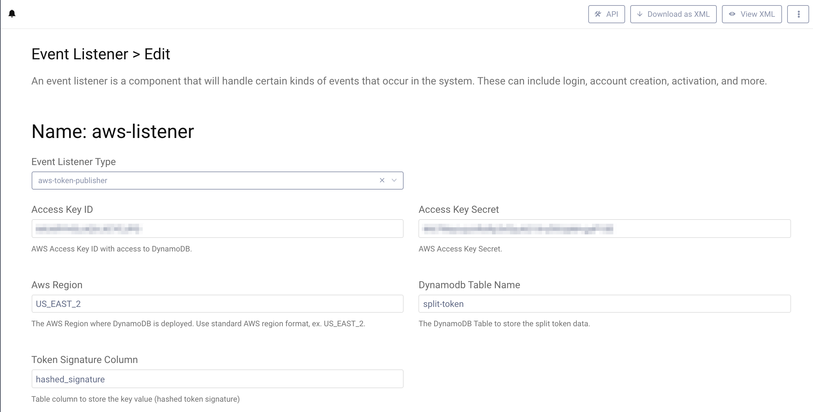

# AWS Token Publisher Demo Plugin

This is an example event listener SDK Plugin for the Curity Identity Server. The plugin registers an event listener
listening for issued access token events, and forwards them to an AWS deployed DynamoDB.

## Changed in 0.1.2
- Optional setting to use an EC2 Instance Profile for DynamoDB access. This allows for assigning an IAM Role with DynamoDB permissions directly to an EC2 instance. The aws-token-publisher will then automatically resolve temporary credentials from that role. If this method is used no Access Key ID, Access Key Secret, Aws Profile Name or Aws Role Arn are needed.  
- The AWS Region is now an Enum and is set through a drop-down menu in the configuration instea dof a text field.

## Changed in 0.1.1
- Using AWS SDK v2 (2.14.14)
    - New SDK version now requires the Region format of `us-west-2` instead of `US_WEST_2`
- Possibility to use credentials from local system (~/.aws/credentials) where plugin is running by specifying a profile name
- Implemented ability to access DynamoDB via AssumeRole when the ARN of the role to assume is specified in configuration
- The `expiration` is now stored as a Number instead of a String so that the [DynamoDB TTL](https://docs.aws.amazon.com/amazondynamodb/latest/developerguide/TTL.html) function can be leveraged to automatically expire the cached token. 

## Building, installation and configuration

To build the plugin, simply download it and run `mvn package`. This creates `identityserver.plugins.events.listeners.aws-token-publisher-0.1.1.jar` and copies all needed dependencies into `target/`
Create a new folder `aws_token_publisher` in `<idsvr_home>/usr/share/plugins/` then copy all the jar files to that folder
and (re)start the Curity Identity Server. Configure a new event listener (shown here using the Admin UI, but could also be configured through the CLI, REST or XML):

Pick a suitable name and then select the "aws-token-publisher" type:

Configure your listener by adding:

- AWS Access Key ID and AWS Access Key Secret or
- AWS Profile Name 
- AWS Region that the DynamoDB is deployed in (used with Key/Secret to access the DB) and used in order to get temporary credentials using AssumeRole.
- Name of the table configured in DynamoDB to hold the split-token information
- Name of the column that is the primary key in the DynamoDB table configured above. This is the column that will store a hash of the token signature

If Access Key ID and Access Key Secret are defined in the configuration these will be used instead of loading credentials from the system if `Aws Profile Name` is also defined.

If `Aws Role Arn` is defined an AssumeRole attempt will be made with the credentials found, either from config (Access Key ID and Access Key Secret) or from profile. The credentials then dont have to have direct access to DynamoDB but instead needs to have access to the role that will provide temporary credentials to access DynamoDB.

Please visit [curity.io](https://curity.io/) for more information about the Curity Identity Server.
