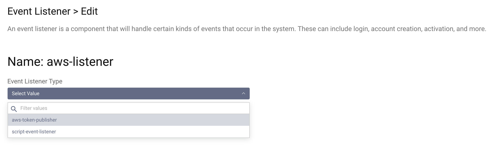
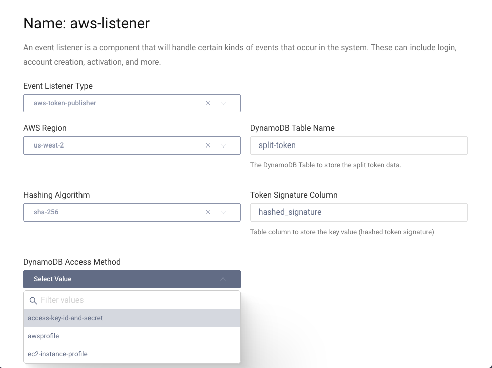

# AWS Token Publisher Demo Plugin

This is an example event listener SDK Plugin for the Curity Identity Server. The plugin registers an event listener
listening for issued access token events, and forwards them to an AWS deployed DynamoDB.

## Building, installation and configuration

To build the plugin, simply download it and run `mvn package`. This creates `identityserver.plugins.events.listeners.aws-token-publisher-0.1.0.jar` and copies all needed dependencies into `target/`
Create a new folder `aws_token_publisher` in `<idsvr_home>/usr/share/plugins/` then copy all the jar files to that folder
and (re)start the Curity Identity Server. Configure a new event listener (shown here using the Admin UI, but could also be configured through the CLI, REST or XML):

Pick a suitable name and then select the "aws-token-publisher" type:

Configure your listener by adding:

- AWS Access Key ID
- AWS Access Key Secret
- AWS Region that the DynamoDB is deployed in (used with Key/Secret to access the DB)
- Name of the table configured in DynamoDB to hold the split-token information
- Name of the column that is the primary key in the DynamoDB table configured above. This is the column that will store a hash of the token signature

Please visit [curity.io](https://curity.io/) for more information about the Curity Identity Server.
